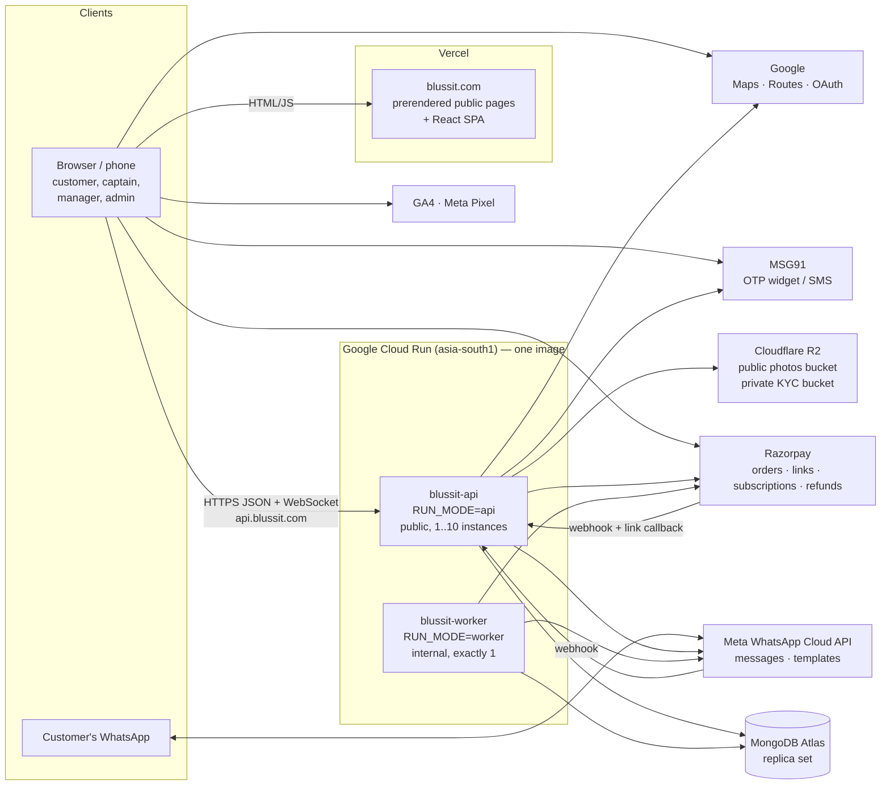

# BLUSSIT — System Architecture

The one document that explains the whole system — what it does, how it is
built, where everything runs, how the data is shaped and how the main flows
work — so a new developer can understand the complete project from here.

**Status:** written 2026-10-07 (branch `blussit-v2`). The 2026-10-07 round
(customer wallet, booking edits, on-site add-ons, custom multi-car plans, new
WhatsApp templates, manager WhatsApp toggle) has landed in the backend; its
screens are being built. Anything still unfinished is marked **in progress**. See "Keeping this
document current" at the end — the founder's standing rule is that every
change updates this file.

Related documents (more depth on one topic each):
[DEPLOYMENT.md](../DEPLOYMENT.md) (operator runbook) ·
[docs/FEATURE_PLAN_WALLET_EDITS_PLANS_2026-10-07.md](FEATURE_PLAN_WALLET_EDITS_PLANS_2026-10-07.md) (current build spec) ·
[docs/SOCIETY_PLANS.md](SOCIETY_PLANS.md) (society plans in detail) ·
[docs/SEO_AUDIT_2026-10-06.md](SEO_AUDIT_2026-10-06.md), [docs/SEO_KEYWORDS.md](SEO_KEYWORDS.md) (SEO) ·
[docs/PRE_PRODUCTION_AUDIT_2026-10-07.md](PRE_PRODUCTION_AUDIT_2026-10-07.md) and
[docs/PRODUCTION_REMEDIATION_REPORT_2026-10-07.md](PRODUCTION_REMEDIATION_REPORT_2026-10-07.md) (audit + fixes, IDs like PAY-02 used in code comments) ·
[docs/SECURITY_REPO_CLEANUP.md](SECURITY_REPO_CLEANUP.md) ·
`backend/tests/README.md`. `CONTEXT.md` at the repo root is an older
(2026-08) hand-off note; where it disagrees with this file, this file wins.

Contents: 1 What BLUSSIT is · 2 Big picture · 3 Repository layout ·
4 Backend (request path, RUN_MODE, health, background jobs, configuration) ·
5 Roles and auth · 6 Data model · 7 Core flows · 8 Frontend · 9 External
services · 10 Deployment · 11 Scalability · 12 Observability · 13 Security ·
14 Testing · 15 Limitations and roadmap · 16 Keeping this document current

---

## 1. What BLUSSIT is

A **doorstep car (and bike) wash** business in **Indore** (blussit.com).

- **Customers** book a wash at their address (website, customer app at
  `/app`, or WhatsApp chat), pick a date and a 3-hour slot, pay online
  (Razorpay) or in cash/QR at the door, and track the job live. They can buy
  **monthly passes** (a number of washes for one car or car type, optionally
  on auto-pay), and residents of housing **societies** buy per-car society
  plans (a daily bucket wash + premium washes).
- **Captains** (field washers) get assigned jobs, travel, prove arrival with
  the customer's 4-digit code and GPS, take before/after photos, and collect
  cash or a QR payment when due. They earn per job into a **captain wallet**.
- **Managers** run one **service center**: the booking queue, assigning
  captains, captain KYC and attendance, complaints, selling plans, societies,
  late-cancellation charges, inventory, the center's KPIs.
- **Admins** run the platform: catalogue and prices, plans, coupons,
  centers/zones/capacity, booking policy, users and staff, WhatsApp
  (templates, CRM inbox), reports and audit logs.

All money is in Indian rupees; all business time is **IST** (people-facing
times are 12-hour, e.g. "9:00 AM – 12:00 PM"; slot keys stay 24-hour
`"09:00-12:00"`). Opening hours are 7 AM – 7 PM.

---

## 2. The big picture



ASCII version:

```
 browser/phone ──HTML──> Vercel (blussit.com: prerendered public pages + SPA)
      │
      ├──HTTPS + WSS──> api.blussit.com = Cloud Run "blussit-api" (RUN_MODE=api, 1..N)
      │                     │  routes, webhooks, websockets (+ relay via ws_events)
      │                     ▼
      │               MongoDB Atlas (replica set: transactions + change streams)
      │                     ▲
      │                     │  sweeps, retries, template sync, index builds, migrations
      │               Cloud Run "blussit-worker" (RUN_MODE=worker, exactly 1, internal)
      │
      ├──> Razorpay checkout modal, MSG91 OTP widget, Google Maps/OAuth, GA4, Meta Pixel
 WhatsApp <──> Meta Cloud API ──webhook──> blussit-api
 Razorpay ──webhook / payment-link callback──> blussit-api
 blussit-api ──> Razorpay, Meta, MSG91, Google Routes, R2 (photos, KYC docs)
 blussit-worker ──> Razorpay (reconciliation), Meta (sends, retries, template sync)
```

Key properties:

- **Stateless API.** Logins are JWTs; nothing about a user lives in an API
  instance's memory. Websocket fan-out across instances goes through the
  `ws_events` collection (each instance tails it with a change stream).
- **Database as the source of truth for everything time-based.** Sweeps
  work from database state, so a restarted or replaced worker simply picks up
  where things are.
- **No Redis, no queue broker.** Background work is asyncio loops in the
  worker; single-flight is a Mongo lease; the WhatsApp queue is a Mongo
  collection with leases and backoff.
- **Fail closed on money and capacity.** Unique indexes + guarded atomic
  updates + transactions; readiness refuses traffic while a critical unique
  index is missing.

---

## 3. Repository layout

```
backend/                      FastAPI service (Python 3.12, Motor/MongoDB)
  Dockerfile                  the ONE image (uvicorn app.main:app); RUN_MODE picks the role
  requirements-runtime.txt    pinned runtime deps (requirements.txt adds dev/test)
  .gcloudignore/.dockerignore keep env files, venvs, tests out of uploads/images
  app/
    main.py                   app wiring: middleware, routers, RUN_MODE, background loops,
                              lease, health/readiness, start-up/shut-down
    core/                     config (settings + production validator), database (client,
                              indexes, critical-index check), security (JWT, hashing),
                              dependencies + authz (role guards, center scoping),
                              rate_limit, storage (local/R2), ws_manager (websocket relay),
                              http_client (pooled outbound HTTP), logging_setup (JSON logs,
                              masking, request ids), exceptions, responses
    routes/v1/                HTTP layer, one router per domain, all under /api/v1
    controllers/              thin glue for some domains (response shaping, audit)
    services/                 business rules (booking_service.py is the heart, ~8.7k lines)
    repositories/             data access (BaseRepository subclasses, index builders)
    models/                   Pydantic document shapes + enums.py
    schemas/                  request/response DTOs
    utils/                    timezone (IST), slots, money rounding, phone + plate
                              normalisation, geo, serializers
    scripts/                  one-off backfills/migrations, seed_dev, smoke test
    seed.py                   reference data + (local only) demo accounts
  tests/                      pytest suite (~160 files) on a local replica-set Mongo
frontend/                     React 19 + TypeScript + Vite SPA (Vercel)
  src/App.tsx                 every route, grouped by role
  src/pages/{public,auth,customer,captain,manager,admin,society,shared}/
  src/components/             ui/ (design system), booking/, customer/, captain/, manager/,
                              admin/, public/, shared/, society/, layout/
  src/api/                    one module per backend domain, all via lib/api-client.ts
  src/lib/                    api-client (axios, token refresh), socket, razorpay,
                              googleMaps, otpWidget, metaPixel, date/price helpers
  src/context/                AuthContext, Toast, Confirm, captain i18n (en/hi)
  src/routes/                 ProtectedRoute / GuestOnlyRoute, prefetch
  src/seo/pages.json          titles/descriptions/canonicals + sitemap source
  src/prerender/entry.tsx     SSR entry used at build time
  scripts/prerender.mjs       build-time prerender of the public pages
  vercel.json                 rewrites, security headers, CSP (report-only), caching
scripts/
  deploy-gcp.sh               build one image, deploy blussit-worker then blussit-api
  dev.sh                      local stack: Mongo (docker, :27099) + backend + website
docs/                         this file and the topic documents listed above
DEPLOYMENT.md                 operator runbook
```

**Adding a backend feature** follows the layers: model → schema →
repository → service → (controller) → route → mount the router in
`include_business_routers()` in `backend/app/main.py` → frontend type in
`src/types/index.ts` → `src/api/<domain>.ts` → page/component → route in
`App.tsx` → nav item in the area's layout. New collections get their indexes
in `create_indexes()` (and in `_CRITICAL_INDEXES` if a business rule depends
on a unique index).

---

## 4. Backend

### 4.1 Request path

```
uvicorn → RequestIdMiddleware (X-Request-ID, log context)
        → WorkerRouteGuard (RUN_MODE=worker: 404 except /api/health, /api/ready)
        → GZip → CORS → LimitRequestBody (413; 2 MB JSON, upload caps)
        → CatchUnhandledErrors (JSON 500 inside CORS)
        → security headers (nosniff, DENY framing, noindex, HSTS, uploads CSP,
          short public cache on anonymous catalogue GETs)
        → rate limit (per IP, per instance)
        → router → dependency guards (auth, role, center scope) → controller/service
```

Every response is JSON `{success, data | error_code, message, details}`.
Domain errors are `AppException` subclasses (400/401/403/404/409); a unique
index refusing a write becomes 409 `CONFLICT`; validation errors are 422.
API docs (`/api/docs`) exist only with `DEBUG=true` (never in production).

### 4.2 RUN_MODE — one image, two services

| | `api` | `worker` | `all` (default) |
|---|---|---|---|
| Business routers, webhooks, websockets, `/uploads` | yes | **no** (not mounted; guard 404s) | yes |
| `/api/health`, `/api/ready` | yes | yes | yes |
| Reminder/sweep loop (lease) | no | yes | yes |
| WhatsApp retry loop, template sync loop | no | yes | yes |
| Index creation, boot backfills/migrations, boot template sync | no | yes | yes |
| Websocket relay (`ws_events` change stream) | yes (delivers) | yes (publishes worker events) | yes |

Production must set `RUN_MODE` explicitly (the validator refuses the
default). Code: `_run_mode()`, `_runs_background_jobs()`,
`_serves_public_routes()`, `WorkerRouteGuard`, `include_business_routers()`,
`on_startup()` in `backend/app/main.py`.

**Boot order.** The worker builds indexes in the background after it starts
answering probes (`_deferred_init`: indexes → employee ids → launch offer →
`last_completed_at` → seat ownership → booking money fields → open
late-cancel charges moved to the customer wallet → booking address
snapshots → template sync; the last three come from the 2026-10-07 round
and are looked up by name in `_OPTIONAL_BOOT_TASKS` — idempotent, skipped
if absent, a failure is logged and retried next boot). The API never
builds indexes; its `/api/ready` only checks that the critical unique indexes
exist. So on a brand-new database the API is not ready until the worker's
first build finishes, and every deploy rolls out the worker first.

**Shutdown.** SIGTERM → uvicorn stops taking requests (4 s) → `on_shutdown`
sets the stop event; loops end at their next checkpoint (never mid-send),
start-up work and background WhatsApp sends get the rest of a 5 s grace, then
the HTTP clients and the database are closed. The lease is released so
another worker can take over at once.

### 4.3 Health and readiness

- `GET /api/health` — liveness. No dependency is touched. 503 `LOOP_DEAD` only
  if a background loop this process started has ended while not shutting
  down (the worker's liveness probe then restarts it). Reports `mode`.
- `GET /api/ready` — readiness. 200 only when Mongo answers a ping within 2 s
  and every index in `_CRITICAL_INDEXES` exists (cached 60 s after success);
  otherwise 503 `NOT_READY` with `checks` (and `missing_indexes`). Used by both
  services' startup probes and the deploy script.

### 4.4 Background jobs (worker)

The **reminder loop** (`_reminder_loop` → `_sweep_once`) runs every 60 s on
the instance holding the lease `locks._id="reminder_loop"` (90 s, renewed
between sweeps and every 10 s inside long ones; a lost renewal stops the pass
at once). Each pass has a 70 s budget; each sweep 15 s of its own and a hard
60 s timeout (below the lease); one failing sweep is logged and skipped.
Paced sweeps stamp their last run on the lease document (`*_at` fields), so a
fresh worker doesn't re-run them. In order:

| Sweep | What | Cadence |
|---|---|---|
| slot holds | release expired seat holds (`_sweep_holds`) | every pass |
| pending orders | ask Razorpay about checkouts whose browser never verified; settle via the shared claim | every pass |
| unpaid expiry | cancel "pay online" bookings past `payment_window_minutes` (only if still unpaid, PAY-02) after asking Razorpay | every pass |
| payment reminders | one nudge before the window closes (+ WhatsApp buttons) | every pass |
| payment links | settle paid Razorpay payment links | every pass |
| autopay renewals / pending mandates | refresh auto-pay passes from Razorpay | every pass |
| captain start reminders | ping the captain ~30 min before the slot | every pass |
| **customer pre-slot reminders** | `booking_reminder` WhatsApp ~2 h before the slot, 7 AM–7 PM, claim-first (BOOKING, 2026-10-07) | every pass |
| unassigned nudges | manager: booking still has no captain (first WhatsApp, repeats in-app) | every pass |
| late to start / not reached / stuck on the way / overrun / idle after arrival / left site | flag the booking + notify (anti-moonlighting checks) | every pass |
| pass expiring / pass expired | notices + flip to expired (10 AM–7 PM only) | every pass |
| society attendance alerts, society schedule | missed daily wash alert; materialise premium-wash visits | every pass |
| recycle-bin purge | hard-delete bookings soft-deleted > 30 days (refused rows parked) | every pass |
| seat counter check | `reconcile_slot_counters(repair=False)`; drift logged as ERROR | daily |
| **review requests** | `NotificationService.send_review_requests()` — Google review ask ~2 h after a completed + fully paid visit, 10 AM–7 PM, only when the admin set `google_review_url` and the `review_request_google` template is approved; atomic claims (NOTIFY, 2026-10-07 — **in progress** until the template is approved) | every 10 min |
| pass wash reminder | "N washes left" (marketing template, opt-out respected) | hourly |
| repeat-booking nudge | "time for a wash?" to lapsed customers | hourly |

Other worker loops (lease-free; the work claims its own rows):

- **WhatsApp retry** (`_whatsapp_retry_loop`): every 30 s, drains
  `whatsapp_queue` in slices (≤ 20 rows / 4 s each, ≤ 100 rows / 25 s per
  pass); backoff 60 s → 30 min; dead-lettered after 7 attempts or 3 h.
- **Template sync** (`_template_sync_loop`): every 5 min asks for a sync;
  `sync_templates_if_due` runs it at most hourly across instances.
- **Websocket relay**: publishes the worker's events to `ws_events`.

### 4.5 Configuration

All settings are in `backend/app/core/config.py` (`Settings`, read from real
environment variables, else an env file: `ENV_FILE`, else
`backend/.env.development`, else `backend/.env` — never `.env.production`).
`validate_settings()` is the one rule list: the app refuses to start on any
problem (all listed at once) and `scripts/deploy-gcp.sh` runs the same check
on the exact values it ships (`python -m app.core.config --check
--require-production`). Names only below — see DEPLOYMENT.md for which are
secrets.

| Group | Settings | Production rule |
|---|---|---|
| App | `APP_NAME`, `APP_ENV` (development/test/staging/production), `RUN_MODE` (api/worker/all), `API_V1_PREFIX`, `DEBUG`, `LOG_FORMAT`, `SENTRY_DSN`, `SENTRY_TRACES_SAMPLE_RATE` | `APP_ENV=production`, `RUN_MODE` explicit, `DEBUG=false` |
| HTTP edge | `CORS_ORIGINS`, `PUBLIC_BASE_URL`, `RATE_LIMIT_ENABLED`, `TRUST_PROXY_HEADERS`, `TRUSTED_PROXY_COUNT` | https site origins only; `https://api.blussit.com`; limits on; trust proxy (Cloud Run) |
| Database | `MONGO_URI`, `MONGO_DB_NAME` | remote cluster (never localhost) |
| Auth | `JWT_SECRET_KEY`, `JWT_ALGORITHM`, `ACCESS_TOKEN_EXPIRE_MINUTES` (15), `REFRESH_TOKEN_EXPIRE_DAYS` (7) | secret ≥ 32 chars, not the default |
| Storage | `STORAGE_PROVIDER` (local/r2), `UPLOAD_DIR`, `R2_ENDPOINT_URL`, `R2_ACCESS_KEY_ID`, `R2_SECRET_ACCESS_KEY`, `R2_BUCKET_NAME`, `R2_PRIVATE_BUCKET_NAME`, `R2_PUBLIC_BASE_URL`, `R2_UPLOAD_PREFIX` | r2 with both buckets; public URL is r2.dev/custom domain |
| WhatsApp | `WHATSAPP_PROVIDER` (log/meta_cloud), `WHATSAPP_ACCESS_TOKEN`, `WHATSAPP_PHONE_NUMBER_ID`, `WHATSAPP_BUSINESS_ACCOUNT_ID`, `WHATSAPP_BUSINESS_NUMBER`, `WHATSAPP_API_VERSION`, `WHATSAPP_OTP_TEMPLATE_NAME`/`_LANGUAGE`, `WHATSAPP_UPDATE_TEMPLATE_NAME`, `WHATSAPP_TEMP_PASSWORD_TEMPLATE_NAME`, `WHATSAPP_TEMPLATE_LANGUAGE`, `WHATSAPP_WEBHOOK_VERIFY_TOKEN`, `WHATSAPP_APP_SECRET` | meta_cloud; all credentials, templates and the business number required |
| SMS / OTP | `SMS_PROVIDER` (""/log/msg91), `MSG91_AUTH_KEY`, `MSG91_OTP_TEMPLATE_ID`, `MSG91_WIDGET_ID`, `MSG91_TOKEN_AUTH`, `OTP_CHANNEL` (whatsapp/sms) | an SMS fallback (msg91 or the widget trio); never `log` |
| Payments | `RAZORPAY_KEY_ID`, `RAZORPAY_KEY_SECRET`, `RAZORPAY_WEBHOOK_SECRET`, `RAZORPAY_LIVE_KEY_ID`/`_SECRET` (parking only) | `rzp_live_` key + secret + webhook secret |
| Google | `GOOGLE_MAPS_BROWSER_KEY`, `GOOGLE_MAPS_SERVER_KEY`, `GOOGLE_OAUTH_CLIENT_ID` | optional |
| Other | `META_PIXEL_ID`, `DEFAULT_PAGE_SIZE`, `MAX_PAGE_SIZE`, `DEV_TOOLS_ENABLED`, `DEV_OTP_CODE` | dev tools refused in production |

Dev tools (fixed OTP `123456`, "log in as") work only with
`DEV_TOOLS_ENABLED=true` **and** `APP_ENV=development` **and** a local
database. Business rules that admins change at runtime are **not** env vars:
they live in the database (booking policy, pricing/commission, capacity,
homepage config, `settings`, `business_settings`, society rate card).

---

## 5. Roles, authentication and authorisation

**Roles** (`UserRole`): `customer`, `captain`, `manager`, `admin`. Captains
and managers belong to one `service_center_id`. Account `status`: `active`,
`pending` (captain onboarding) — allowed; `inactive`, `suspended` — refused at
login, on every token use and on refresh (`core/authz.py:account_switched_off`;
customers get 400 `ACCOUNT_INACTIVE`).

**Tokens** (`core/security.py`, `services/auth_service.py`).
- Access JWT (HS256, 15 min): `sub`, `role`, `email`, `phone`,
  `service_center_id`, `tv` (= the user's `token_version`).
- Refresh JWT (7 days): `tv`, a single-use `jti` and a family id `fam`.
  `POST /auth/refresh` rotates: the old `jti` is written to
  `spent_refresh_tokens`; presenting it again within 30 s is treated as a
  multi-tab race, later as **reuse** → the whole family is revoked
  (`refresh_token_families`) and audited (`REFRESH_TOKEN_REUSE`).
- Revocation = bump `token_version` (logout, password change/reset, staff
  resets, first phone proof of a customer which also clears an unproven
  password). Every request reloads the user (`get_current_user` →
  `resolve_access_token`) and rejects a token whose `tv`, role or center no
  longer match the database — **role and center always come from the
  database, never from the token.**
- Passwords: bcrypt (on a worker thread); login checks always cost one bcrypt
  (no account-enumeration timing); 5 failures lock the account for 5 min.
- The browser keeps both tokens in `localStorage`; `lib/api-client.ts`
  refreshes ahead of expiry and once on a 401, one refresh at a time across
  calls (rotation-safe across tabs); network errors and 5xx never log out.

**Ways to sign in.**
- Staff (and customers with a password): email/phone + password.
- Customers: phone **OTP** (`/auth/otp/request` + `/auth/otp-login`) or the
  **MSG91 OTP widget** (token verified with MSG91, bound to the phone, and
  single-use via `used_widget_tokens`), or **Google** (ID token checked
  against `GOOGLE_OAUTH_CLIENT_ID`; links only to password-less customer
  accounts; phone collected later).
- Anonymous web booking ends with an OTP (purpose `booking_confirmation`)
  that creates/proves the customer (`ensure_customer_by_phone`,
  `mark_phone_proven`).

**OTP rules.** Purposes `verification`, `booking_confirmation`,
`password_reset`, each consumer accepts only its own (`OTP_ACCEPTS`).
10-minute codes, 5 guesses, 30 s resend cooldown, 5 sends/hour per (phone,
requester) and 15/hour per phone (a stranger can't lock someone's login).
Delivery: WhatsApp first (authentication template, or free text inside an
open 24 h chat), SMS (MSG91) as fallback; `OTP_CHANNEL` flips the order.

**Staff phone proof.** An admin/manager types a staff member's phone, so it
is not proof of anything: self-service password reset by code works for staff
only after they verified that exact number themselves
(`self_verified_phone`); otherwise an admin/manager resets it
(`POST /auth/staff/{id}/reset-password`). The WhatsApp bot never adopts or
"proves" a staff account.

**Guards** (`core/dependencies.py`): `require_customer`, `require_captain`,
`require_manager`, `require_admin`, `require_manager_or_admin`,
`require_staff`, `require_any`, `get_optional_user`.

**Center scoping** (`core/authz.py`): `ensure_own_center` (admins bypass;
otherwise both sides must have the same center), `manager_center_or_raise`,
`customers_known_to_center` (a customer is "known" to a center through a
booking there, a plan from it, or a society enrollment in one of its
societies), `ensure_customer_in_scope` (404, not 403, outside it),
`resolve_grant_center_id` (which center a plan sale is credited to). Every
captain step re-checks the booking's center against the captain's current
center.

**Websockets** authenticate the same access token (`?token=`, because
browsers can't send headers on the handshake; it is masked in logs) and
authorise each channel subscription (see 8.3).


---

## 6. Data model (MongoDB)

One database (`MONGO_DB_NAME`) on an Atlas **replica set** — multi-document
transactions (seat reservation, settlement, wallet posts) and change streams
(websocket relay) both need it; the local dev/test Mongo is a one-node
replica set for the same reason. All indexes are declared in
`backend/app/core/database.py:create_indexes()` (plus
`ensure_queue_indexes` in notification_service, `ensure_society_indexes` /
`ensure_society_schedule_indexes` in the society repositories and
`ensure_custom_plan_indexes`). A failed index build only logs; replacing a
unique index builds the new one before dropping the old (`_ensure_replacing_index`).

**Critical unique indexes** (`_CRITICAL_INDEXES`, checked by `/api/ready`):
bookings `uniq_active_customer_slot_v3`, `booking_number`, `uniq_visit_seat_v1`;
payment_orders `uniq_rzp_order`, `uniq_rzp_link`, `uniq_rzp_mandate`; users
`phone`, `email`; `whatsapp_message_dedup.wamid`; slot_capacity (center, date,
slot); daily_capacity (center, date); slot_holds (center, date, slot, holder);
capacity_policy_changes (center, effective_date); customer_charges
(visit_key, kind); customer_wallets `customer_id`; customer_wallet_ledger `key`.

Recurring patterns (look for them before inventing new ones):

- **Insert-first claims** — a document whose `_id` is the thing being claimed
  (`pass_claims`, `payment_order_claims`, `booking_locks`,
  `razorpay_webhook_events`, `used_widget_tokens`, `whatsapp_message_dedup`,
  `society_generation_locks`): the unique `_id` makes "only one wins" a
  database fact; stale claims are taken over atomically.
- **Guarded atomic updates** — `find_one_and_update` with the expected state
  in the filter (status, `holds_seat: true`, `booked_count < capacity`,
  `customer_reminder_sent_at: null`, …): settle once, release once, send once.
- **Idempotency keys on ledgers** — unique `key` on wallet rows
  (`customer_wallet_ledger`, captain `wallet_transactions` `cw:{booking}:{rev}`).
- **Soft delete + recycle bin** — `is_deleted` / `deleted_at` on bookings
  (30-day auto purge); hard deletes refused when money references a row.
- **Audit** — `audit_logs` (kept forever) for every staff/admin change, with
  before/after where relevant.

### 6.1 Identity and access

| Collection | Purpose | Key fields / invariants |
|---|---|---|
| `users` | every account | `role` (customer/captain/manager/admin), `status` (active/inactive/suspended/pending), `phone` (10-digit, unique sparse), `email` (unique sparse), `employee_id` (CAP-NNN, unique sparse), `service_center_id` (staff), `token_version`, `phone_verified`, `self_verified_phone` (staff), embedded `kyc` (captain KYC; numbers masked for managers), login lockout fields, notification toggles (`whatsapp_new_booking_alerts`, default on; `last_review_request_at`) |
| `counters` | atomic sequences | `booking_number` (BK10000+), `captain_employee_id` |
| `otp_requests` | OTP codes | hashed code, `purpose`, attempts (5 guesses), 10-min TTL; send caps per (phone, requester) and per phone |
| `used_widget_tokens` | MSG91 widget tokens are single-use | `_id` = sha256(token), TTL |
| `spent_refresh_tokens`, `refresh_token_families` | refresh-token rotation + reuse detection | TTL |
| `uploaded_documents` | who uploaded each KYC/identity document (download authorisation) | |
| `uploaded_photos`, `upload_counters` | job-photo audit trail (each fresh upload usable once); daily upload caps | |
| `audit_logs` | who did what | actor, module, action, target, center, before/after |

### 6.2 Customers, catalogue and places

| Collection | Purpose | Notes |
|---|---|---|
| `vehicles` | customer cars/bikes | `registration_number_normalized` (same plate allowed on ≤ 2 accounts), `vehicle_type_id` |
| `addresses` | saved addresses | lat/lng; editing one never moves a live booking (bookings keep `address_snapshot`, written at create and on edit, backfilled at boot by `backfill_address_snapshots`) |
| `vehicle_types` | hatchback/sedan/SUV/…/bike | admin-managed, `slug` unique |
| `categories`, `services`, `combo_offers` | catalogue | per-vehicle-type prices; `original_price` = display-only MRP; `is_addon`; `variant_group` (bike counts); 4-digit service codes for quick booking |
| `service_centers` | hubs | `code`, location + radius, `service_pincodes`, working hours, per-slot and per-day capacity; `is_active` (stored `true` on create; every lookup treats a missing field as active — `ACTIVE_CENTER = {"is_active": {"$ne": False}}` in `service_center_repository.py`) |
| `service_zones` | coverage polygons | 2dsphere; address → center: zones → nearest center → pincode |
| `capacity_policy_changes` | effective-dated capacity per center | unique (center, effective_date) |
| `coupons`, `coupon_usages`, `coupon_user_usage` | discount codes | per-user use counted atomically (`{coupon}:{user}` counter) |
| `faqs`, `testimonials`, `contact_messages`, `settings` (+ `settings_history`), `business_settings` | content and admin settings | `PUT /settings` refuses keys that have dedicated endpoints |
| `coverage_leads`, `site_visits`, `plan_enquiries`, `road_distance_cache` | marketing/ops data, distance cache | |

### 6.3 Bookings and capacity

| Collection | Purpose | Key fields / invariants |
|---|---|---|
| `bookings` | one document per **car** on a visit | `booking_number`; `booking_group_id` (all cars of one visit share it); `customer_id`, `vehicle_id`/`vehicle_type`, services, `address_id` (+ `address_snapshot`); `service_center_id`, `captain_id`; `scheduled_date` (IST calendar date), `scheduled_slot` ("09:00-12:00"); `status`; money: `subtotal`, `discount_amount`, `travel_charge`, `total_amount`, `payment_method`, `payment_status`, `captain_earning`, `platform_earning`, `wallet_settled`/`captain_wallet_posted`; plan: `subscription_id`, covered services; `issue_flag`; arrival code + attempt lock; photos + GPS per step; `is_deleted` |
| `booking_status_history` | every status change | |
| `slot_capacity` | seats per (center, date, slot) | unique; `capacity`, `booked_count`, `held_count`, `is_closed`; reserve only while `booked_count < capacity` |
| `daily_capacity` | seats per (center, date) | unique; same guard |
| `slot_holds` | a customer's temporary hold while checking out | unique (center, date, slot, holder); released by the sweep (not a TTL, so `held_count` drops with it) |
| `booking_locks` | short insert-first lock around a booking's multi-step change | TTL |
| `captain_locations` | GPS breadcrumbs | TTL 30 days |
| `migrations` | one-time boot migration markers | |

**Seat ownership (BOOK-02/03).** A visit holds exactly one seat. The booking
records `holds_seat` + `seat_key {service_center_id, date, slot_key}` in the
same transaction that increments the counters; every release is a guarded
flip `holds_seat: true → false` in the same transaction as the decrement, so
a seat is returned exactly once (cancel vs delete vs reschedule races are
safe). `uniq_visit_seat_v1` stops two seats for one visit;
`uniq_active_customer_slot_v3` stops duplicate active bookings for the same
customer, car line and slot. A nightly report (`reconcile_slot_counters`)
compares counters with owned seats; an admin can repair.

**Status machine** (`_ALLOWED_TRANSITIONS` in `booking_service.py`):

```
awaiting_payment ─> pending | cancelled
pending          ─> assigned | cancelled | rescheduled | completed (manager mark-done) | awaiting_payment
assigned         ─> assigned (reassign) | captain_on_the_way | pending | cancelled | rescheduled | completed
captain_on_the_way ─> service_started | pending | cancelled
service_started  ─> completed | cancelled
rescheduled      ─> assigned | rescheduled | cancelled | completed
```

Active statuses (count against capacity/duplicates): awaiting_payment,
pending, assigned, captain_on_the_way, service_started, rescheduled.

### 6.4 Payments and money

| Collection | Purpose | Key fields / invariants |
|---|---|---|
| `payment_orders` | every checkout attempt: one-time **order**, payment **link**, or auto-pay **mandate** | partial-unique `razorpay_order_id` / `razorpay_link_id` / `razorpay_subscription_id`; `open_key` (one open checkout per booking/visit/pass); purpose (booking, subscription, society, custom plan); frozen amount + priced vehicle type; `status`; `settling`; refund fields |
| `payment_order_claims` | insert-first lock serialising order creation per key | |
| `razorpay_webhook_events` | webhook de-dup (`_id` = event id; removed again if processing fails so Razorpay's retry works) | TTL 30 d |
| `razorpay_refunds` | each refund recorded once | |
| `razorpay_plans` | Razorpay plan per (plan, vehicle type, amount) for auto-pay | unique |
| `customer_charges` | late-cancellation charge records (tier, amount, reduce/waive history) | unique (visit_key, kind); status open/applied/waived/settled; settlement moves to the wallet (2026-10-07) |
| `customer_wallets` | one balance per customer — **can be negative**; `carried_due` reserves debt riding on an unpaid booking | unique `customer_id`; posted only by `CustomerWalletService.post` (one transaction: guarded `$inc` + ledger row) |
| `customer_wallet_ledger` | immutable rows: signed amount, kind, balance after, actor, booking, note, `meta` | unique idempotency `key`; kinds (`CustomerWalletEntryKind`) include cancellation, cancellation charge, overpayment, booking spend, payout, adjustment and `refund` ("Plan Refund": one custom-plan car, `meta.custom_plan_id`, key `cp-refund:{cart}:{vehicle}`) |
| `customer_paybacks` | one row per manager payback (MONEY-2): customer, booking + number, center, amount split into `wallet_amount` / `goodwill_amount`, method, reference, reason, note, signals, paid by (id/name/role), `created_at` | unique idempotency `key`; (center, created_at); booking_id; (customer, created_at). Mirrored on the booking as `manager_paybacks[]` + `paid_back_total` (≤ what the customer paid for it) |
| `captain_wallets` | captain balance + `minimum_balance` (₹50; below it no new jobs) | unique `captain_id` |
| `wallet_transactions` | captain ledger | unique `key` (`cw:{booking}:{rev}`): delta-based posting |
| `withdrawal_requests` | captain payouts: pending → approved/rejected, approved → paid/rejected | one pending per captain |

**Settle once (payments).** Browser verify, the Razorpay webhook and the
reconciliation sweep all settle through one guarded claim
(`_apply_order_paid`: open → paid with `settling: true`); whichever is first
wins, the others are no-ops. A payment that can't be applied (target
cancelled, car retyped, amount mismatch) is parked as `paid_attention` for an
admin; refunds go `refund_due` → `refunded` (admin, or a verified
`refund.processed` webhook). Verify fetches the payment from Razorpay and
captures an authorised one before settling (PAY-09).

**Booking money (2026-10-07, spec 1.5).** `total_amount`,
`wallet_applied`, `amount_paid`, `amount_due = max(0, total − wallet_applied −
amount_paid)`, `payment_status` pending / partially_paid / paid / refund_due /
refunded (`services/booking_money.py`, `services/money_service.py`). Every
collection path charges `amount_due`; overpayment goes to the customer
wallet; the captain wallet is posted as deltas against
`captain_wallet_posted`, so completion, later cash collection and add-ons
never double count.

**Tips (MONEY-2, 2026-10-07).** A tip on a manager-done job carries its own
`tip_method` (cash | online, default cash), independent of `payment_method`:
it is added to `total_amount` / `platform_earning` / `amount_paid` and to the
`paid_cash` or `paid_online` bucket of ITS method. A tip saved before the
field existed is cash (`migrate_legacy_tip_method`, run by the boot
`backfill_booking_money`, moves it out of `paid_online`). Collections count
`tips_cash` / `tips_online`.

### 6.5 Plans, passes and societies

| Collection | Purpose | Key fields / invariants |
|---|---|---|
| `subscription_plans` | plan definitions | `plan_type` (standard / society / hidden custom template), per-type prices, `category_quotas` / `included_service_ids`, `total_service_count`, `billing_cycle`; society plans never public |
| `user_subscriptions` | **passes** — one per car (or car type) per plan period | `customer_id`, `plan_id`, `vehicle_id` (car-bound) or `vehicle_type`, `remaining_service_count` / `remaining_by_category` (custom: `remaining_by_service`), `start_date`/`end_date` (30-day period; washes usable only inside it), `status` (`SubscriptionStatus`: active / expired / cancelled / paused / **scheduled** — a renewal paid ahead, live for the one-live-pass rule, not bookable before its start), payment fields, `extensions[]`, `society_id`/`enrollment_id`, `custom_plan_id`; PLANS-2: `renewal_of_subscription_id` (new pass → the one it renews), `renewed_by_custom_plan_id` / `renewed_by_subscription_id` (old pass → its successor; no more extensions), `promoted_at` (scheduled → active), `refund` (a refunded car: {amount, max_amount, washes, reason, by, by_role, at, subscription_id, key}) | partial index `scheduled_pass_start` (`start_date` where status = scheduled) for the promotion sweep |
| `pass_claims` | one live pass per identity (`vehicle:`, `type:`, `plan:`, `society-plate:` keys), inserted **before** the pass | all keys or none; stale claims taken over |
| `custom_plans` | manager-built multi-car cart (per car: per-service counts; frozen price; link or cash) | status draft → awaiting_payment → activating → active / needs_review / cancelled / **refunded** (every car refunded); `revision` guard (paying an old revision parks); PLANS-2: `renewal_of` (the cart it renews), `renewal_cart_id` (old cart → its one open renewal), per car `renews_subscription_id` and `refund` (+ car status `refunded`); indexes (center, created_at), (customer, created_at), `car_refund_at` (`cars.refund.at`, sparse — plan refunds per KPI window) built by `ensure_custom_plan_indexes`; hidden template plan `_id 0000000000000000000c0571` |
| `societies`, `society_enrollments`, `society_attendance`, `society_payments`, `society_schedule_rules`, `society_visits`, `society_schedule_requests`, `society_settings` (`rate_card`, `schedule`), `society_generation_locks`, `society_leads` | society plans — see [SOCIETY_PLANS.md](SOCIETY_PLANS.md) | one open request per resident; one attendance row per society per day; idempotent visit materialisation (`uniq_occurrence_key`) |

**Pass consumption.** A covered wash is reserved at booking create
(`plan_consumption` → `commit_consumption`, a guarded decrement) and given
back on cancel (`restore_consumption`) — under the 1-hour rule from
2026-10-07 (cancel within 1 h of the slot uses the wash up). Add-ons on a
covered visit are always paid.

### 6.6 Messaging, CRM and realtime

| Collection | Purpose | Notes |
|---|---|---|
| `notifications` | in-app notifications (bell) | TTL 90 d |
| `whatsapp_queue` | durable send queue | statuses sending (120 s lease) / sent / pending (retry at `next_at`, 60 s → 30 min) / failed / dead (7 attempts or 3 h); 10-min de-dup key; TTL 30 d |
| `whatsapp_outbox` | log of every send (provider `log` writes only here) | `wamid`, template, status from Meta's status webhook; TTL 365 d |
| `whatsapp_inbox` | inbound messages | TTL 365 d |
| `whatsapp_conversations` | one per WhatsApp user: bot state, CRM inbox, `bot_paused`, unread, opt-out | unique `wa_id` |
| `whatsapp_message_dedup` | inbound `wamid` de-dup (a re-delivered "Confirm" can't book twice) | TTL 14 d |
| `whatsapp_templates` | synced from Meta (status, category, language) + local definitions | unique `name` |
| `sms_outbox` | SMS log | TTL 365 d |
| `ws_events` | websocket relay bus | TTL 300 s |
| `locks` | worker lease `reminder_loop` (+ paced-sweep stamps), template-sync lock | |

### 6.7 Operations

`complaints` (center/booking/society), `reviews` (one live review per
booking), `inventory` (per center, quantities > 0), `attendance` (one per
captain per day, with location), `leave_requests`, `purchase_confirmations`
(tokenised confirmation pages, TTL).


---

## 7. Core flows

### 7.1 Booking: quote → create → pay → assign → wash → collect → complete

1. **Quote.** `POST /bookings/quote` → `BookingService.quote_visit` — the one
   bill used by the website, the app and the WhatsApp bot (services per car
   type, first-wash price, coupon, travel charge for distance via Google
   Routes `travel_charge_km`, pass coverage, wallet / previous balance).
   Anonymous callers get a neutral quote (no first-time or pass lookup).
2. **Hold a slot** (optional, website): `hold_slot` reserves a seat for 5
   minutes in `slot_holds` (≤ 5 holds per IP /64, one per holder, at most half
   a slot) so it can't be sold while the customer types the OTP.
3. **Create.** `POST /bookings/quick` (website/app; anonymous → OTP first,
   checked by `precheck_quick_booking` before the code is spent), the
   logged-in app (`POST /bookings`, `/bookings/group`), staff on a customer's
   behalf (`/bookings/manager-create`, `/bookings/manager-quick`; a manager
   can also log a finished job, `/bookings/manager-log-completed`), or the bot. One car →
   `create_booking`; several cars → `create_booking_group` (one seat, one
   trip, travel paid once, all-or-nothing). Inside one Mongo transaction:
   serialise the customer, refuse overlaps, reserve slot + day capacity with
   guarded counters (unknown slot = fail closed), stamp `holds_seat` /
   `seat_key`, apply the customer wallet (`MoneyService.apply_wallet_at_create`:
   positive balance spent, negative balance carried on the first paying car
   as "Previous Balance Due"). After commit: pass wash committed (`commit_consumption`; losing the
   race rolls the booking back), history, notifications, websocket pings —
   side effects never fail the booking. A price higher than the customer saw
   returns 409 `PRICE_CHANGED`.
4. **Status at birth.** `awaiting_payment` when the customer chose online (or
   a `prepaid_only` service) — the seat is held for
   `payment_window_minutes` (30); otherwise `pending` (confirmed; cash / QR at
   the door). Staff and bot bookings are confirmed at once.
5. **Pay online.** `POST /payments/create-order` (purposes: booking,
   booking group, subscription, society, custom plan) → Razorpay modal →
   `POST /payments/verify` (signature + fetch + capture-if-authorised) →
   `_apply_order_paid` (settle once) → booking money updated →
   `confirm_awaiting_payment_booking` (→ `pending`) → receipt template.
   Missed verify? The webhook or `sync_pending_orders` settles it through the
   same claim. Never paid? The expiry sweep re-asks Razorpay, then cancels
   only if still unpaid and releases the seat. The customer can switch to
   cash. WhatsApp bookings pay by **payment link** (`/payments/link-callback`
   page, webhook `payment_link.paid`, `sync_pending_links`).
6. **Assign.** Manager: `assign_captain` / `assign_captain_to_group` (one
   captain per visit; captain re-read inside the transaction: right center,
   active, wallet ≥ minimum, no overlapping job incl. travel buffer)
   or `self_assign`; managers get a WhatsApp for each new booking (their only
   WhatsApp), everything else in-app.
7. **Captain steps** (captain app, all geo-stamped):
   `start_heading` (`captain_on_the_way`, inside the start window; late starts
   flagged) → `verify_vehicle` with the customer's **4-digit service code**
   (5 wrong codes lock it + alert; manager unlocks) → `capture_before_photo`
   (`service_started`) → `capture_after_photo_and_complete` (`completed`).
   Photos must be this captain's own fresh upload (≤ 6 h), each used once;
   GPS outside the geofence flags, never blocks; too-fast jobs are flagged.
8. **Collect.** If money is due the captain collects **cash**
   (`/payments/collect/cash`, quotes the expected amount — 409
   `AMOUNT_DUE_CHANGED` if it moved; `expected_amount` stays optional so an
   old cached app works through a deploy, but a call without it logs a
   warning) or shows a Razorpay **QR link**
   (`/payments/collect/link`, polled via `/collect/status`). From 2026-10-07
   the app asks "Collect Cash or Online?" for exactly `amount_due` and the
   customer can pay what's due online any time; if both land, the extra
   becomes customer wallet credit. Completion no longer marks cash paid.
   Captain app (`components/captain/CollectPayment.tsx`, calls in
   `api/captainOnsite.ts`): "Collect ₹X" → Cash ("I Collected ₹X Cash",
   quoting X) or Online (QR); `/collect/status` is polled (4 s with the QR,
   15 s otherwise) so a customer paying from their phone clears the screen;
   the job card shows Total / Paid / Wallet Credit Used / Due
   (`components/captain/JobMoney.tsx`).
9. **Complete + captain wallet.** Completion settles the captain wallet once:
   cash kept by the captain → the platform's share is debited; paid online /
   by plan → the captain's earning is credited. From 2026-10-07 this is
   delta-based (`MoneyService.settle_captain_wallet`). Then the customer can
   review; a Google-review WhatsApp follows ~2 h later (once the template is approved
   and `google_review_url` is set).

Sweeps watch every step (section 4.4): unassigned, late to start, not
reached, stuck on the way, idle after arrival, left site, overrun.

### 7.2 Cancel, reschedule, edit, add-ons, recycle bin

- **Cancel** (`cancel_booking` / `cancel_booking_group`, one transaction):
  customers may cancel until the captain heads out; staff any time (charge
  only "at the customer's request", reducible). Tier from
  `late_cancellation_quote`: > 4 h before the slot free · 1–4 h ₹50 · < 1 h
  or after the start ₹80 · captain already left ₹100 (staff only) — amounts in
  the booking policy. Business/expiry/society cancels are never charged.
  Money (2026-10-07): paid − charge is credited to the customer wallet, an
  unpaid late cancel debits the charge (balance may go negative); the charge
  record stays in `customer_charges`. Plan cars: wash returned if cancelled
  ≥ 1 h before, used up inside 1 h (`consumption_forfeited`; staff may
  return it with `return_plan_wash`). The seat is released exactly once.
  Customer cancel serialises against `start_heading` by writing every car of
  the visit in its transaction.
- **Reschedule** (`reschedule_booking`): the whole visit and its seat move in
  one transaction; an assigned captain is released and told.
- **Customer edit** — date/slot, address (same center only), services,
  car, notes; > 1 h before the slot; re-priced; difference credited or due;
  manager flagged in-app (`customer_edited_at` / `customer_edited_fields`);
  history + audit (`PATCH /bookings/{id}`, `PATCH /bookings/group/{gid}`);
  unchanged cars keep their booked price; first-wash eligibility kept as at
  create; seat moves via `_seat_move_begin` / `_seat_move_finish`.
  `dry_run: true` runs the real edit transaction and aborts it, returning
  the exact new total / amount due / wallet credit / `travel_charge` (the
  visit's distance charge after the edit, also per car in `cars[]`) — the
  customer app's "before saving" preview.
- **On-site add-ons** — captain (after arrival) or manager adds services
  (`POST /bookings/{id}/add-services`); recorded in `added_services[]` +
  `added_services_total`; captain earning unchanged; the new total is due
  via `MoneyService.on_price_change`. **Offered services only** (QA
  2026-10-07): on-site adds and edits take only what the booking page
  offers that vehicle type — services listed for the type; the add-a-bike
  line (Extra Bike Wash) only on a BIKE booking, where it is the bike
  counter (smallest variant + Extra Bike Wash × the rest, like the booking
  page's 3+ bikes), never as a pick on a car; an edit may keep what the car already carries
  (`BookingService._ensure_offered_for_type`). Every add-on picker in the
  app (booking page, Book A Plan Wash, Edit Booking, captain and manager
  Add Service) uses the one filter `offeredAddons` in `lib/serviceMix.ts`. Captain app: "Add Service" sheet
  (`components/captain/AddServicesSheet.tsx`) — services for the car's type
  at that type's price, a "New Total ₹X" confirm, added lines shown on the
  job ("By You"). Concurrent identical adds (a double tap / retry) are
  refused, not added twice: the transaction re-checks the car's service
  mix fingerprint it validated against. The response carries the enriched booking and
  `next_job_conflict` — if the longer job runs into the captain's next
  assigned job, managers get an in-app warning (never blocked).
- **Recycle bin** (admin): soft delete returns seat, pass wash and coupon
  use; restore re-takes them or is refused; hard delete is refused when
  captain-wallet money references the booking; auto-purge after 30 days.

### 7.3 Plans and passes

- **Buy (customer):** online only. `create-order` purpose `subscription`
  (`validate_purchase` first; vehicle type frozen on the order) → settle →
  `_create_subscription` behind `pass_claims` (one live pass per car / car
  type). **Auto-pay:** a Razorpay subscription (mandate); renewals arrive via
  `sync_autopay_renewals` (quota refilled for the new cycle);
  turning auto-pay off ends it at the cycle end.
- **Sell (manager):** preview → offer as a payment link, cash, or auto-pay
  mandate; voidable; credited to the manager's center. Admin can grant.
- **Redeem:** a booking for a covered service and car type is ₹0 for the
  covered services; add-ons are paid. Washes are usable only inside the
  pass's 30-day period. Auto-apply on a type-only line (website, bot,
  manager-quick): standard passes, including car-bound ones — the line then
  becomes that pass's car (`vehicle_id` stamped); choice order: no-car
  passes, most washes left, earliest end, oldest. Society and custom passes
  are explicit only (line carries `vehicle_id` + `subscription_id`; the
  customer app's "Book A Plan Wash" sheet). A line naming a car only takes
  that car's pass.
- **Extend:** manager of the pass's center or admin, in the
  last 3 days or after the end while washes remain, ≤ 10 days per period,
  audited. Applies to every pass kind (`POST /subscriptions/{id}/extend`,
  `UserSubscriptionService.extend_pass`); reviving an ended pass re-checks
  the car has no other live pass. Success message (both extend routes,
  `extension_message`): "Extended by 4 days — Last Booking Day: 19 Oct
  2026" — the human form of `last_bookable_day`, the same day every pass
  screen shows; "already has an active plan" refusals show that day too
  (`usable_until_label` / `last_booking_day_text`, extension included).
- **Custom multi-car plan** (manager cart: per car, per-service counts;
  catalogue price minus ≤ 50 % discount; link or cash; one car-bound pass per
  car with per-service quotas `total_by_service` / `remaining_by_service`)
  (`custom_plan_service.py`, `/subscriptions/custom-plans`; activation from
  `payment_service` → `CustomPlanService.activate_from_payment`, idempotent).
  Preview and create share `_customer_for`: the customer by id or by phone
  + name (preview never creates the account or saves a car); a saved
  `vehicle_id` only for a customer known to the actor's center; a car on a
  live pass (named by id or by plate) is refused by both with the same
  words.
- **Renew a custom plan (PLANS-2):** staff renew a paid cart → a NEW cart
  (`renewal_of`) with the old cars and per-service counts by default (or an
  edited list), priced at **today's** catalogue, paid by link or cash like
  any cart. On activation, a car whose old pass is still live gets a
  `scheduled` pass starting 00:00 IST the day after the old pass's Last
  Booking Day (`next_period_start`), for 30 days; the car's one-live-pass
  claim moves to the new pass at once (the car stays held through both
  periods); the old pass keeps its washes until its end and is stamped
  `renewed_by_custom_plan_id` / `renewed_by_subscription_id`, so it can no
  longer be extended. A car without a live old pass (or added in the
  renewal) starts today. A scheduled pass is promoted to `active` by the
  ended-pass sweep (`promote_scheduled_passes`) or lazily on first use —
  both guarded and idempotent; views read it as active from its start.
  Subscription overviews (manager + admin) show passes waiting for their
  start as their own group: KPI `scheduled`, filter `status=scheduled`, row
  status `scheduled` (never inside `active`). **Renewal preview:**
  `POST /custom-plans/preview` with `renewal_of` (the paid cart being
  renewed, or a draft renewal being revised; the actor must reach that
  cart) prices for the cart's customer and applies exactly renew / revise's
  live-pass rule (`_refuse_cars_on_live_pass`: a car's own renewed pass lets
  it through, any other live pass refuses it) — so preview = renew price.
  Admin can renew and refund from `/admin/custom-plans` too (same builder
  and dialog as managers).
- **Refund one car (PLANS-2, `refund_car`):** unused washes × the per-wash
  price the car paid after the cart discount (a skipped car: its whole
  share); staff may refund less. ONE transaction: the pass cancelled with
  its washes zeroed and its claim released (a scheduled renewal hands the
  car back to the pass it renewed), the car marked `refunded`, the wallet
  credited (kind `refund`, key `cp-refund:{cart}:{vehicle}` — a double tap
  credits once). Refused while the pass has live bookings.
- **Customer app (custom plans, `CustomPlanCard` + `arrangeCustomPlans`):**
  an upcoming renewal (unpaid, or paid with every pass `scheduled`) sits
  inside the plan it renews — unpaid: "Renew Your Plan — New Period Starts
  …" + the cart's `pay_label` (https link only); paid: "Next Period Starts …"
  with per-service counts. A scheduled pass shows "Starts …" and is never
  bookable; a refunded car shows "Refunded ₹X To Your Wallet"; a fully
  refunded cart is Past. Customers never renew themselves: within 3 days
  of the plan's last booking day, with no renewal, the card offers "Ask Us
  To Renew" (WhatsApp, prefilled).
- **Last Booking Day:** every pass screen and message names the last day a
  booking can use the pass as "Last Booking Day: 18 Oct 2026"
  (`last_booking_day_text`; extension included). Pass dates have no
  leading zero ("6 Nov 2026"): one helper, `app.utils.timezone.day_label`,
  makes `last_booking_day_label`, `starts_on_label`,
  `renewal_starts_on_label`, the society `last_booking_day_label`, the
  extension / "continues on" / "starts on" messages and custom-plan
  notices (older booking / payment messages keep their own format).
- **Expiry:** notices 2 days before and at the end (daytime only), then
  flipped to `expired`. A pass whose renewal is already paid (custom-plan
  renewal, `renewal_lined_up`) is told "Your plan continues on 18 Oct 2026 —
  next period already paid" instead of "renew to keep going" / "Renew any
  time" (generic utility template, never the renew templates); a renewal
  refunded since no longer counts.
- **Plan revenue — gross, refunds, net:** plan revenue (`plan_revenue`,
  `combined_revenue`, a plan-purchase row's `amount`, the manager
  dashboard's plan `revenue`) stays GROSS — paid plan `payment_orders` in
  the window. Custom-plan car refunds made in the window
  (`custom_plan_refunds`, dated by `cars[].refund.at`) are shown beside it:
  admin + manager KPI overviews and the explorer (totals, previous, each
  series bucket) carry `plan_refunds` and `plan_revenue_net`; the manager
  dashboard's plan sales `refunds` / `revenue_net` (also on the custom
  plan's row); plan-purchase rows `refunded_amount` / `net_amount` (every
  refund on that cart); `UserSubscriptionService.center_plan_refunds` sits
  beside `center_plan_revenue`. Under an explorer service / car-type slice
  custom carts (no type on the order) are out of both gross and refunds.

### 7.4 Societies

Lead (landing form / staff) → manager registers the society (its center is
resolved from the pin) → shareable form link `/society/{token}` → resident
enrols cars (phone OTP) → pays online (`create-order` purpose `society`) or
manager marks cash → one pass per car (daily bucket wash + premium-wash
quota). Captain checklist: arrive (GPS) and tick washed cars daily; missed
attendance alerts the manager. Premium washes are normal bookings (a day
ahead) or materialised by the schedule planner sweep. Renew per enrollment,
extend ≤ 10 days. Full design: [SOCIETY_PLANS.md](SOCIETY_PLANS.md).

### 7.5 WhatsApp: bot, CRM and notifications

- **Inbound:** Meta → `POST /api/v1/whatsapp/webhook` (signature
  `X-Hub-Signature-256` with `WHATSAPP_APP_SECRET`; always 200). Delivery
  statuses update the outbox (and opt-outs); duplicates are dropped
  (`whatsapp_message_dedup`); every message lands in the CRM inbox first.
  Unless the conversation is paused (an agent took over, or a 12 h hand-off),
  the **bot** walks car type → service → address/location → time → hold →
  confirm → `create_quick_booking(source="whatsapp")` → cash or payment link.
  Staff numbers are routed to the CRM only.
- **CRM inbox** (admin, `/whatsapp/crm`): conversations, replies, media,
  pause/resume bot, templates (submit to Meta, sync status), delivery health
  (`GET /whatsapp/crm/delivery-health`, cached 15 s per instance, `?fresh=1`
  recomputes — the card's Refresh; cards: Sent, Sending, Retrying =
  `pending`, Failed = `failed`, Undelivered, Dead, Refused).
- **Outbound — `NotificationService.notify(user, title, body, type, ref,
  wa_event=…, wa_params=…)`:** always writes the in-app notification; then
  WhatsApp unless the user opted out of marketing (marketing templates),
  is a manager (only new-booking alerts, with a per-manager switch `whatsapp_new_booking_alerts`), or is muted. The send is enqueued in
  `whatsapp_queue` (de-duplicated) and attempted at once (request paths wait
  ≤ 1 s); failures are retried by the worker. Each event has its own approved
  template (`event_template_if_ready`), falling back to the generic update
  template; outside a customer's 24 h window free text is never sent.
  The staff **universal message** (`POST /notifications/universal-message`)
  is capped at `UNIVERSAL_MESSAGE_DAILY_CAP` (5) per customer per rolling
  24 h across all staff (429 `RATE_LIMITED`), counted from `whatsapp_queue`.
  New templates this round (review request, universal message, book now,
  payment failed, wallet credited/debited, booking cancelled v5, booking
  edited, plan expiring v2, manager new booking v2) are defined in code;
  they work once the founder submits them (Admin → WhatsApp → Templates)
  and Meta approves them — until then the generic update template is used
  (template-only events like review request and book now are skipped).
- **SMS:** OTP fallback only (MSG91).

### 7.6 Customer wallet

- One balance per customer (`customer_wallets`), may go negative; every
  change is an immutable `customer_wallet_ledger` row with a unique key, so a
  retried post is a no-op.
- **Credits:** prepaid cancel (paid − charge), price drop on a prepaid edit,
  overpayment / duplicate / late payments, a reduced or waived cancellation
  charge, admin adjust.
- **Debits:** unpaid late-cancel charge, credit spent at booking create,
  a manager payback (below), a Razorpay refund taken from wallet credit,
  admin adjust.
- **At create:** a positive balance is spent on the visit (`wallet_applied`);
  a negative balance rides on the first paying car (`wallet_due_carried`,
  reserved as `carried_due`) and clears when that car is paid. Reducing a
  charge whose debt is carried lowers that booking's total instead.
- **Payback (founder 2026-10-07, MONEY-2).** A manager never adds money to
  a wallet at will. He only pays money BACK for one booking of that customer
  that was cancelled, delayed or had an issue, from the center's side (cash /
  UPI / bank), and records it: `POST /customers/{id}/wallet/payout` with
  `booking_id` (his center's; admin any), `reason` (cancelled / delayed /
  complaint / service_issue / other + note ≥ 10), `method`, `reference`
  (unless cash), `amount`, `note`, optional `idempotency_key`.
  Eligibility (`CustomerWalletService.payback_signals`): status cancelled;
  delayed = `delay_minutes` > 0, a late-start penalty, or a late/overrun
  issue flag; any `issue_flag` / `resolved_issue_flag`; a complaint on the
  booking. Else 400 `PAYBACK_NOT_ALLOWED`. Wallet credit is debited first
  (kind `payout`, booking linked, "Paid By Manager <name>"); the rest is a
  goodwill payback on the booking only (no wallet movement), never on a
  cancelled booking (its money already went back to the wallet →
  `WALLET_BALANCE_TOO_LOW`). Per booking, `paid_back_total` ≤
  `booking_money.paid_by_customer` (`PAYBACK_TOO_MUCH`). One transaction
  (payback row, ledger row, booking `$push manager_paybacks` — each row with
  its `reason_label`, filled on read for older rows); idempotent on
  (booking, method, reference) / (booking, idempotency_key) / cash
  (booking, amount, minute). Audited `CUSTOMER_PAYBACK`.
- **The only free movement** is the admin's audited
  `POST /customers/{id}/wallet/adjust`. Manager paths that can still credit
  a wallet are each tied to real money or a charge: cancelling / deleting a
  paid booking (what was paid comes back), reducing or waiving a
  cancellation charge, and payments beyond what is due (overpayment).
- **Who sees what.** A booking's `manager_paybacks[]` / `paid_back_total`
  are in the customer's own booking views (their money) and staff views,
  never in a captain's (`_CAPTAIN_HIDDEN_FIELDS`: job list, booking and
  visit reads, every captain action answer incl. the priority flag).
  Customer `GET /wallet/me`: the whole ledger. Staff
  `GET /customers/{id}/wallet`: every entry carries `own_center`; an admin
  sees all; a manager sees amounts / kind / date / balance after for every
  entry, but an entry tied to another center's booking has `booking_label`
  "Other Center" and no booking id/number, note, reason, reference or actor.
- **Admin list + reports.** `GET /wallet/payouts?service_center_id=&date_from=&date_to=`:
  every payback (wallet and goodwill: booking number, reason, method, who
  paid, center) plus older wallet payouts (`source`). Collections:
  `paid_back_by_managers` (per center for a manager, per center + total for
  admin) and `net_collected` = cash + online − paid back.
- Code: `customer_wallet_service.py` (ledger), `money_service.py` (booking
  money: `apply_wallet_at_create`, `apply_payment`, `on_booking_cancelled`,
  `on_price_change` + `after_price_change`, `settle_captain_wallet`),
  `booking_money.py` (pure helpers).

### 7.7 Payments: webhooks, reconciliation, refunds

`POST /api/v1/payments/webhook` (HMAC with `RAZORPAY_WEBHOOK_SECRET`; 404
when unset; event ids de-duplicated): `payment.captured` / `order.paid` →
settle the order; `payment.failed` → record; `payment_link.paid` → settle the
link; `refund.processed` → mark refunded (once per refund id);
`subscription.*` → nudge the mandate sweep. Three independent paths reach the
same settle-once claim (browser, webhook, sweep), so a payment is never lost
and never applied twice. Duplicate or surplus payments go to the customer
wallet (2026-10-07; previously parked for refund). Refunds themselves are
issued by an admin in Razorpay; the app tracks `refund_due` → `refunded`.


---

## 8. Frontend (blussit.com)

### 8.1 Stack and build

React 19 + TypeScript + Vite (rolldown), React Router 7, TanStack Query 5
(server state; no Redux), axios, react-hook-form + zod, Tailwind 4,
framer-motion, Leaflet/OpenStreetMap + Google Maps, react-helmet-async.
`npm run build` = sitemap → `tsc -b` → `vite build` → **prerender**:

- `scripts/prerender.mjs` + `src/prerender/entry.tsx` render every public
  route in `src/seo/pages.json` (`/`, `/doorstep-car-wash-indore`,
  `/services`, `/services/{jet-wash, star-wash, waterless-car-wash,
  car-deep-cleaning, bike-wash}`, `/plans`, `/book`, the four policy pages)
  to static HTML with the live catalogue fetched at build time; the React
  Query cache is dehydrated into `window.__BLUSSIT_QUERIES__` so the browser
  starts from the same data. `/` → `dist/index.html`, others →
  `dist/_pages/<route>.html`; the plain app shell → `dist/spa.html`.
- `vercel.json`: rewrites public URLs to `/_pages/*.html` and
  `/app|admin|manager|captain/*`, `/login`, `/forgot-password`,
  `/thank-you`, `/society/:token` to `/spa.html`; `/about` → `/`; security
  headers (DENY framing, nosniff, HSTS, Permissions-Policy allowing camera and
  geolocation on our own origin), **CSP in Report-Only**, immutable
  `/assets/*`, 7-day images.
- The build refuses to run without `VITE_API_BASE_URL`, and a Vercel
  **preview** build refuses to point at `api.blussit.com` (unless
  `ALLOW_PREVIEW_PROD_API=1`).

SEO details: [SEO_AUDIT_2026-10-06.md](SEO_AUDIT_2026-10-06.md).

### 8.2 Structure and routing

`src/App.tsx` (QueryClient → Auth → Toast → Confirm providers) holds every
route; authenticated pages are lazy-loaded.

| Area | URLs | Guard |
|---|---|---|
| Public | `/`, `/services`, `/services/:slug`, `/plans`, `/doorstep-car-wash-indore`, policy pages, `/book`, `/thank-you`, `/society/:token` | none |
| Auth | `/login`, `/forgot-password` | guest only (logged-in users go to their home) |
| Customer app | `/app/*` (home, book, bookings + detail (Edit Booking sheet → PATCH /bookings/{id} or /group/{gid} with expected_total; cancel shows the cancellation-charge-preview wallet effect first; amount due + Pay Now), garage, addresses, subscriptions — incl. custom-plan carts; car-bound passes (custom-plan cars and monthly passes bought for one car) book through the "Book A Plan Wash" sheet with vehicle_id + subscription_id on the quick-booking line, since the server never auto-applies a car-bound pass to a by-type booking; the edit sheet previews with PATCH dry_run, `/app/wallet` (balance + ledger; WhatsApp wallet messages link here), offers, support, profile, settings, `/app/society/:token`) | customer |
| Captain | `/captain/*` (today, jobs, job, societies, attendance, earnings, profile; English/Hindi) | captain |
| Manager | `/manager/*` (dashboard, queue, new booking, log job, captains, sell plan, custom plans, subscribers, charges, societies + planner, complaints, reviews, inventory) | manager |
| Admin | `/admin/*` (dashboard, bookings, users, services, vehicle types, combos, plans, purchased plans, custom plans (view + Renew Plan / Refund Car, and finishing a renewal), society plans/societies/planner, coupons, pricing, slot capacity, centers, zones, homepage, charges + wallet payouts, complaints, reviews, contact messages, coverage leads, plan enquiries, WhatsApp, audit logs) | admin |

This round's staff/customer screens (2026-10-07/08): custom plan Renew Plan /
Refund Car (manager + admin, `components/manager/CustomPlanCard` +
`RefundCarDialog`; the renewal builder previews with `renewal_of`), card
headers count only cars still on the plan and show "₹X Paid · ₹Y Refunded"
(`lib/customPlanTotals.ts`, customer and staff alike), payback dialog
(`components/shared/PaybackDialog`; rows read the server's `reason_label`),
tip method (cash / online), wallet "Other Center" rows, and "Last Booking
Day: 6 Nov 2026" wording on every pass view — customer app, society hub
(`/app/society/:token`), staff society detail and the extend toast
(`components/customer/passDates.ts`).

`ProtectedRoute` sends anonymous users to `/login` and wrong roles to `/`.
`src/api/*` has one module per backend domain; `src/types/index.ts` mirrors
backend shapes. Request timeout 30 s (uploads 120 s).

### 8.3 Realtime

`lib/socket.ts` opens one shared socket to `wss://api.blussit.com/api/v1/ws?token=…`
only while a screen subscribes (`useLiveChannel`), reconnects with backoff,
refreshes a near-expiry token, pauses in hidden tabs. Channels (authorised
server-side in `ws_routes.py:_authorize_channel`, ≤ 50 per socket):

| Channel | Used by | Who may subscribe |
|---|---|---|
| `user:{id}` | staff shells (bell) | that user |
| `center-bookings:{center}` | manager queue | admin, that center's manager |
| `slots:{center}:{date}` | slot pickers | any logged-in user |
| `booking:{id}` | customer booking detail | admin, its customer, its captain, that center's manager |
| `captain-location:{captain}` | live captain map | admin, the captain, that center's manager |

Messages are "something changed — refetch" pings (captain location carries
coordinates). Everything authoritative comes from REST; screens also poll.

### 8.4 Browser integrations

Razorpay checkout (`lib/razorpay.ts`, orders and auto-pay mandates), Google
Maps Places/markers (browser key served by the API; falls back to manual
address entry), Leaflet + Nominatim (map picker, live captain map), Google
Sign-In (client id from `GET /auth/google-config`), MSG91 OTP widget
(`lib/otpWidget.ts`, falls back to backend OTP), GA4 (gtag, loaded 2.5 s after
page load), Meta Pixel (`lib/metaPixel.ts`, only on the blussit.com host;
Purchase counted once). No service worker / PWA manifest yet. Frontend env
vars: `VITE_API_BASE_URL`, `VITE_WHATSAPP_NUMBER`, `VITE_CALL_NUMBER`,
`VITE_DEV_OTP_HINT` (all public — never secrets).


---

## 9. External services

| Service | Used for | Where | Failure isolation |
|---|---|---|---|
| **MongoDB Atlas** (replica set) | all data; transactions; change streams | `core/database.py` (pool 30/instance, 5 s server selection, 60 s socket timeout) | readiness 503; requests fail fast |
| **Razorpay** | one-time orders (checkout modal), payment links (WhatsApp, captain QR), subscriptions/mandates (auto-pay), refunds tracking, webhooks | `services/payment_service.py` (sync SDK on a separate thread pool with its own timeouts, PERF-02) | three settle paths + reconciliation sweeps; gateway outages pause sweeps, never double-settle |
| **Meta WhatsApp Cloud API** | OTPs, booking/plan notifications (templates), bot conversations, CRM inbox, template submission + sync, delivery statuses | `services/whatsapp_service.py`, `whatsapp_bot_service.py`, `whatsapp_crm_service.py`, `notification_service.py` | durable queue + retries + dead letters; 401/403 classified as configuration errors (`failure: auth`) |
| **MSG91** | OTP widget (browser) + token verification; SMS OTP fallback | `msg91_widget_service.py`, `sms_service.py` | 503 `Msg91Unavailable`; WhatsApp is the first channel |
| **Google** | Routes API (road distance → travel charge, ETA; cached in `road_distance_cache`), Maps JS in the browser, Sign-In (ID token check) | `route_service.py`, `google_auth_service.py`, frontend `lib/googleMaps.ts` | distance falls back; maps fall back to manual entry |
| **Cloudflare R2** | public bucket: job photos (public URLs); private bucket: KYC/identity documents (served only through `GET /api/v1/uploads/document/{key}` with authorisation) | `core/storage.py` (signed S3 requests, magic-byte checks, 8 MB) | 503 `STORAGE_UNAVAILABLE` (retryable) |
| **Vercel** | hosts the website (static + SPA) | `frontend/vercel.json` | independent of the API |
| **GA4, Meta Pixel** | analytics / ads attribution (browser only; Pixel also on the payment-link result page) | `index.html`, `lib/metaPixel.ts` | — |
| **Sentry** (optional) | error tracking hook | `core/logging_setup.py:init_error_tracking` | off unless `SENTRY_DSN` + `sentry-sdk` |

Outbound HTTP uses one pooled `httpx` client per integration
(`core/http_client.py`, 20 connections, ≤ 5 s connect, per-integration read
timeouts: Meta 10–30 s, Routes 6 s, MSG91 10 s, R2 60 s).


---

## 10. Deployment

Full runbook: [DEPLOYMENT.md](../DEPLOYMENT.md). In short:

- **Backend:** `scripts/deploy-gcp.sh` validates `backend/.env.production`
  with the app's own validator (once per RUN_MODE), stores secrets in Secret
  Manager, builds **one** image (`gcloud builds submit`, Artifact Registry
  `cloud-run-source-deploy/blussit-backend:<time>-<sha>`), deploys
  **`blussit-worker`** (`RUN_MODE=worker`, min = max = 1, CPU always on,
  internal ingress, no public invoke, startup probe `/api/ready`, liveness
  `/api/health`), waits for it to be ready, then deploys **`blussit-api`**
  (`RUN_MODE=api`, public, 1–10 instances, concurrency 250, 3600 s timeout
  for websockets, 1 GiB, CPU always on, startup probe `/api/ready`) and
  checks `https://…/api/ready`. `--dry-run` prints both commands; `--only
  api|worker` deploys one; `DEPLOY_IMAGE=` redeploys a known image.
- **Domain:** `api.blussit.com` → `blussit-api` (Cloud Run domain mapping,
  DNS-only — not proxied). The worker has no public URL.
- **Rollback:** per service (`gcloud run services update-traffic … --to-revisions=REV=100`)
  or redeploy a known image. Emergency: `RUN_MODE=all` on the API runs
  everything in one service.
- **Frontend:** Vercel builds `frontend/` on push (`VITE_API_BASE_URL` per
  environment; previews need a non-production API).
- **Local:** `scripts/dev.sh up` (Mongo replica set in docker on :27099,
  backend with `RUN_MODE=all`, website on :5173; OTP 123456).

**Failure independence.** Worker down → customers still book and pay (verify
+ webhook settle payments); reminders, expiries, reconciliation, retries and
template sync pause and catch up on return. API down → the worker keeps
sweeping. Two workers → the lease lets one sweep. A bad revision of either
never receives traffic (startup probe) and the deploy stops before the API if
the worker fails.

## 11. Scalability

| Concern | Today | Limit / recommendation |
|---|---|---|
| API instances | stateless; 1–10 (`CLOUD_RUN_MAX_INSTANCES`) | raise freely within the Mongo budget below |
| Mongo connections | 30 per instance (`maxPoolSize`, URI can override); timeouts set | `(API max + 1 worker) × 30 × 2` (deploy overlap) ≤ Atlas cap: 10 instances → 660; M10 allows 1,500, M0/M2/M5 500 |
| Websocket fan-out | `ws_events` + change stream on every instance (PERF-01 fixed) | one change-stream cursor per instance; TTL 300 s keeps it small |
| Rate limits | in memory **per API instance** (`core/rate_limit.py`) | N instances = up to N× a limit; OTP/login/coupon/money caps are database-backed. Add a shared store (Redis/Memorystore) if abuse appears |
| Background work | one worker, lease single-flight, per-pass (70 s) and per-sweep (15 s / 60 s hard) budgets | backlog spills to the next pass by design; split a heavy sweep out, or shard by center, if a sweep regularly hits its budget |
| Capacity correctness | guarded counters + seat ownership + unique indexes in transactions | verified with 100 concurrent buyers for 5 seats |
| Outbound APIs | pooled clients, timeouts, Razorpay on its own thread pool, WhatsApp via durable queue | Meta/Razorpay/R2 outages degrade one feature, not the API |
| Heavy reads | KPI/report caching (`report_cache.py`), bounded list queries, covered indexes | admin KPIs over very long ranges are the heaviest queries |

## 12. Observability

- **Logs:** JSON lines in production (`LOG_FORMAT`; severity, message,
  `request_id`, Cloud Trace link via `GOOGLE_CLOUD_PROJECT`), plain text
  locally. A logging filter masks phone numbers (last 4 digits), OTPs,
  passwords, tokens (incl. the websocket `?token=`), hashes and URI passwords
  on **every** record. Uvicorn access logs are off.
- **Request ids:** `X-Request-ID` accepted or generated, returned on every
  response (413/500/CORS included) and attached to every log line.
- **Health/readiness:** `/api/health` (liveness, loop health, `mode`),
  `/api/ready` (database + critical indexes, `mode`).
- **Business signals in logs:** seat-counter drift (ERROR, daily), sweep
  timeouts, lease errors, WhatsApp dead letters, `paid_attention` payments,
  `LOOP_DEAD`. Admin screens: WhatsApp delivery health, payments needing
  attention, charges, audit log.
- **Alerts / error tracking:** to set up in Cloud Monitoring on the JSON logs;
  Sentry hook ready (`SENTRY_DSN`).

## 13. Security model

- **Edge:** HTTPS only (HSTS), CORS limited to the site origins, body caps
  (413), per-IP rate limits (trusting only Cloud Run's appended
  `X-Forwarded-For` entry), `X-Robots-Tag: noindex` on the API, no API docs in
  production, uploads served inert (`default-src 'none'; sandbox`).
- **Identity:** short access tokens, rotating single-use refresh tokens with
  family revocation, `token_version` revocation, account status enforced on
  every request, role/center re-read from the database, OTP purpose binding
  and caps, single-use widget tokens, staff phone proof before self-reset,
  login lockout, constant-cost login.
- **Authorisation:** role guards on every route; center scoping for managers
  and captains (`core/authz.py`); customer scope (404 outside it); captain
  steps re-check center and assignment; customer booking reads (detail,
  list, edit result, own cancel) hide earnings and captain-wallet
  bookkeeping (`_CUSTOMER_HIDDEN_FIELDS`); captain reads hide
  `platform_earning` and the service code; KYC numbers masked for managers;
  private documents only through the authorised download route.
- **Money:** amounts always computed server-side (quote = create);
  `expected_total` / `PRICE_CHANGED`; Razorpay signature + fetch/capture;
  webhook HMAC + event de-dup; settle-once claims; unique Razorpay ids;
  idempotent ledgers; live keys enforced in production.
- **Webhooks:** Razorpay HMAC (`RAZORPAY_WEBHOOK_SECRET`), Meta
  `X-Hub-Signature-256` (`WHATSAPP_APP_SECRET`, fail closed).
- **Secrets:** only in Secret Manager / the local git-ignored env file; the
  deploy refuses tracked env files and any upload containing one
  (`.gcloudignore`); production refuses default/short JWT secrets, test keys,
  local databases and dev tools. The worker is not reachable from the
  internet.
- **Audit:** every staff/admin change in `audit_logs` (actor, before/after).
- Repository hygiene and the historic data exposure: see
  [SECURITY_REPO_CLEANUP.md](SECURITY_REPO_CLEANUP.md).

## 14. Testing

- **Backend:** pytest + pytest-asyncio + httpx `ASGITransport`, against a
  **local replica-set Mongo** (never Atlas — `backend/.env` may point at
  production). One database per run, dropped and seeded at session start
  (`tests/conftest.py` pins WhatsApp to `log`, Razorpay to fake test keys, and
  turns Google off). Run from `backend/`:

  ```bash
  MONGO_URI="mongodb://127.0.0.1:27099/?replicaSet=rs0&directConnection=true" \
  TEST_MONGO_DB_NAME=my_test_db .venv/bin/python -m pytest -q -p no:warnings tests/<files>
  ```

  (or `scripts/dev.sh test`). Never `source` an env file to get `MONGO_URI`.
  Conventions: `test_fix_<area>_*.py` = regression tests for audit fixes
  (each failed on the old code), `test_feat_<area>_*.py` = new features
  (e.g. `test_feat_arch_run_mode.py`, `test_feat_arch_deploy.py`,
  `test_feat_arch_wiring.py`), shared builders in `tests/factories.py` /
  `society_factories.py`. Concurrency tests run real parallel requests on the
  replica set. `deploy-gcp.sh` is tested offline with stubbed `gcloud`/`curl`.
  Isolation rules: suites must clean up the service centers and payment
  links they create (other suites' sweeps and nearest-center lookups see
  them); WhatsApp-bot suites place their center on the bot's pin and switch
  off competing leftovers per test; `make_service_center(latitude=…,
  longitude=…)` places a center explicitly.
- **Frontend:** `npx tsc -b`, `npm run build` (includes the prerender),
  `npm run lint` (oxlint); no unit-test runner yet — UI is checked with
  Playwright/Chrome walkthroughs at phone and desktop widths.

## 15. Known limitations and roadmap

- **In progress (2026-10-07):** customer wallet + ledger + payouts, booking
  money (`amount_due`, partial payments), customer cancel any time before the
  captain leaves with the new money rules, customer booking edits (1-hour
  lock), on-site add-ons, custom multi-car plans, general pass extension,
  manager WhatsApp toggle and fixes, new WhatsApp templates (review request,
  universal message, book now, payment failed, wallet lines, edited,
  cancelled v5, plan expiring v2, manager new booking v2), review-request
  sweep. Spec: [FEATURE_PLAN_WALLET_EDITS_PLANS_2026-10-07.md](FEATURE_PLAN_WALLET_EDITS_PLANS_2026-10-07.md).
- Rate limits are per instance (no shared store).
- CSP is Report-Only; switch to enforcing after reviewing reports.
- No push notifications / PWA; WhatsApp + in-app only.
- Refunds are issued manually in Razorpay (the app tracks them).
- Local-storage mode (development only) serves uploaded documents under
  `/uploads/documents/…` without authorisation; production enforces R2,
  where documents live in the private bucket behind the authorised route.
- Captain KYC is not required before assignment (CAP-08 — founder decision
  pending).
- Travel charge can change between quote and booking if Google Routes
  recovers mid-flow (caught by `PRICE_CHANGED` when it rises).
- Load beyond a few hundred concurrent requests hasn't been tested;
  multi-instance behaviour was simulated on one replica set.
- External actions outstanding before launch: see
  [PRODUCTION_REMEDIATION_REPORT_2026-10-07.md](PRODUCTION_REMEDIATION_REPORT_2026-10-07.md)
  §7 (Razorpay live + webhook, Meta templates + webhook fields, Atlas
  connections/backups, monitoring, repo history purge).

## 16. Keeping this document current

Founder rule (2026-10-07): **this file is the single description of the whole
system and is updated with every change.** When you change the project:

1. Update the affected section(s) here in the same change — new collection or
   index (§6), new route/flow (§7), new background job (§4.4), new setting
   (§4.5 and DEPLOYMENT.md), new external service (§9), deployment change
   (§10, DEPLOYMENT.md).
2. When an item marked **in progress (2026-10-07)** lands, remove the marker
   and describe what was actually built (names of collections, endpoints,
   sweeps).
3. Keep it factual and short; link to a topic document for depth instead of
   copying it.
4. Add a line to the change log below.

### Change log

| Date | Change |
|---|---|
| 2026-10-09 | First-time login by phone: `POST /auth/otp/request` now sends a code to a number with no customer account (response `new_account: true`; staff numbers and unknown emails are still refused). `POST /auth/otp-login` for an unknown number first only CHECKS the code (non-consuming, still counts an attempt) and answers `{needs_name: true}`; the same code + `full_name` then creates the customer (`ensure_customer_by_phone`) and signs in. Login page gets a "Your Name" step after the code. `verify_otp` / `verify_phone_proof` gained `consume=False`. Fix: `lowercase_user_emails` is a module function again (it had swallowed `UserRepository.list_by_role`). |
| 2026-10-09 | Log A Completed Job: where it was done is now a saved address of the picked customer (chips, default pre-selected), "+ New Address" (map pin or typed address + optional pincode) or plain text. `ManagerLogBookingRequest` takes `address_id` (must be that customer's), `address` (QuickAddress) or `address_line`; new pinned addresses are saved with their pin; no coverage check (job is already done). |
| 2026-10-08 | Account emails are stored lower-case and email login is case-insensitive: staff create lower-cases the email, `UserRepository.find_by_email` / `find_by_identifier` match either case, boot task `lowercase_user_emails` lower-cases existing rows (skips collisions, logged); login / forgot-password / staff-create inputs lower-case as you type (no auto-capitalise on phones). |
| 2026-10-08 | FINAL-POLISH: custom-plan preview takes `renewal_of` (paid cart, or draft renewal being revised) and applies renew/revise's live-pass rule — the staff renewal builder uses it instead of its by-type workaround; `manager_paybacks[]` rows carry `reason_label` (stamped on write, filled on read in `_enrich_bookings` for old rows); pass date labels/messages unpadded via `day_label` ("6 Nov 2026"); `test_staff_car_type_service_names` plan-purchase test and `test_feat_small_plan_net`'s ±1 h window clock-safe around IST midnight (the explorer series buckets whole IST days from the window start). UI: society hub, staff society detail and the extend toast say "Last Booking Day: …"; `UserSubscription` gains `scheduled`, extension fields, `last_booking_day_label`, custom-pass fields, `starts_on(_label)` (casts removed); custom plan card headers (customer + staff) leave refunded cars out of counts and show "₹X Paid · ₹Y Refunded"; admin custom plans get Renew Plan / Refund Car (and link / cash / revise / cancel on a renewal). Tests: `tests/test_feat_polish_*.py`. |
| 2026-10-07 | Customer app (FE-CUSTOMER-3): custom-plan renewal on `CustomPlanCard` (renewal nested in the plan it renews via `arrangeCustomPlans`; "Renew Your Plan — New Period Starts …" + `pay_label`; "Next Period Starts …"; scheduled cars "Starts …", not bookable; refunded cars "Refunded ₹X To Your Wallet"; fully refunded carts under Past; "Want To Continue? Ask Us To Renew" on WhatsApp within 3 days of the end). "Last Booking Day: …" on every customer pass view (`components/customer/passDates.ts`, falls back to `last_bookable_day` / `end_date`). Wallet: `refund` = "Plan Refund", `payout` = "Paid Back To You" with reason · method. Edit Booking: bike counter uses the booking page's range (3+ bikes); "Distance Charge" from the dry run's `travel_charge`. |
| 2026-10-07 | SMALL batch: `CustomerWalletEntryKind.REFUND` ("Plan Refund") and `SubscriptionStatus.SCHEDULED` (= `PASS_SCHEDULED`); subscription overviews group scheduled passes on their own (KPI `scheduled`, `status=scheduled`; a started-but-unpromoted one reads active); car retype/removal, user and center delete guards count scheduled passes as live; renewal-aware pass-ending / pass-ended notes (`renewal_lined_up`: "Your plan continues on … — next period already paid"); net plan revenue — `plan_refunds` + `plan_revenue_net` beside the unchanged gross on KPI overviews / explorer, `refunds` / `revenue_net` on manager plan sales, `refunded_amount` / `net_amount` on plan-purchase rows, `center_plan_refunds`, index `car_refund_at`; captain booking views hide `manager_paybacks` / `paid_back_total` (and the captain's priority answer is now redacted like his other reads); PLANS-2 notes added to §6.5 / §7.3; `test_manager_subscription_offers.py` no longer asserts global collection emptiness. Tests: `tests/test_feat_small_*.py`. |
| 2026-10-07 | MONEY-2: manager payout replaced by a booking-linked **payback** (cancelled / delayed / issue bookings only; wallet credit first, else goodwill on the booking; per-booking cap; `customer_paybacks` collection; `CUSTOMER_PAYBACK` audit); admin `GET /wallet/payouts` filters by center/date and lists wallet + goodwill paybacks; collections `paid_back_by_managers` + `net_collected`, `tips_cash` / `tips_online`; tips carry `tip_method` (cash default; legacy tips migrated to cash); staff wallet view marks `own_center` and hides another center's booking details from a manager. Edits / on-site adds on a bike booking accept Extra Bike Wash × N (2 → 4 bikes prices like a fresh 4-bike booking; still refused on cars); edit answers (save + dry run) carry `travel_charge` (visit + per car). Tests: `tests/test_feat_money2_*.py`. |
| 2026-10-07 | QA fixes: centers created via `POST /service-centers` store `is_active: true` and every center lookup treats a missing field as active (new centers were invisible to address lookup); custom-plan preview takes the same customer identification as create and refuses cars on a live pass like create; `/payments/collect/cash` logs a warning without `expected_amount` (unused `paymentApi.collectCash` removed); delivery health cache 60 s → 15 s + `?fresh=1`; extension message "usable until 19 Oct 2026" and live-pass refusals honour the extension; on-site adds / edits refuse services the booking page doesn't offer the type, all add-on pickers share `offeredAddons`. UI: flag codes shown as labels (`issueLabel`), delivery-health status labels + Refresh, template catalogue as cards on phones, "Select Date", "Open In Maps", "Used For Booking". Tests: `tests/test_feat_qa_*.py`. |
| 2026-10-07 | Security review of the feature round: customer booking views no longer carry `captain_wallet_posted` / `captain_cash_collected` / `captain_wallet_captain_id` / `captain_wallet_rev`; a customer's own cancel answers redacted; universal message capped at 5 per customer per 24 h; concurrent duplicate on-site add-ons refused. Tests: `tests/test_feat_sec_*.py`. |
| 2026-10-07 | Follow-up: every display/geofence reader uses `address_snapshot` (staff directory, bot, customer 360, area KPI); legacy applied charges settle on the wallet; add-on next-job warning; edit `dry_run`; car-bound standard pass auto-apply restored (regression from the SOC-4 fix); `/payments/collect/link` returns `amount` in rupees + `amount_paise`; overview rows gain `usable_until` / `last_bookable_day` / `society_id`; charge views gain `settlement` / `wallet_credited`; manager collections gain `custom_plans`; `STAFF_RESET_REFUSED`; test-isolation fixes. Customer app: `/app/wallet`, custom-plan cards, "Book A Plan Wash" sheet for car-bound passes, Edit Booking sheet with exact preview, cancel preview with wallet outcome. |
| 2026-10-07 | Staff UI for wallet/edits/plans: `/manager/custom-plans` (cart builder + list), `/admin/custom-plans`, wallet panel + payout/adjust + Send WhatsApp Message in the customer drawer, Extend on any pass, WhatsApp new-booking switch (manager profile, admin users), template catalogue + Google review URL + config warnings (Admin → WhatsApp), Wallet Payouts tab on admin charges, Add Service / Customer Edited / Paid-Due / Part Paid in the booking drawer, Return The Plan Wash + wallet result on staff cancel. New FE modules `api/customPlans.ts`, `api/customerWallet.ts`, `api/staffBookings.ts`. |
| 2026-10-07 | Captain app: on-site "Add Service" sheet, job money card (Total / Paid / Wallet Credit Used / Due), "Customer Changed This Booking" note, "Collect ₹X — Cash or Online" at the end (409 `AMOUNT_DUE_CHANGED` refetch, wallet-credit notice, status polling). |
| 2026-10-07 | Backend of the feature round landed: customer wallet + booking money (partial payments, overpayment → wallet, delta captain wallet), customer cancel until the captain heads out, customer edit with 1-hour lock, on-site add-ons, address snapshots, custom multi-car plans + per-service quotas, extension for every pass, manager WhatsApp toggle + delivery fixes, new templates, review-request sweep. |
| 2026-10-07 | Document created. API + worker split (`RUN_MODE`, two Cloud Run services from one image), worker wiring for the pre-slot customer reminder and review requests, boot migrations (booking money, open charges → wallet, address snapshots), `WHATSAPP_BUSINESS_NUMBER` required in production. |
